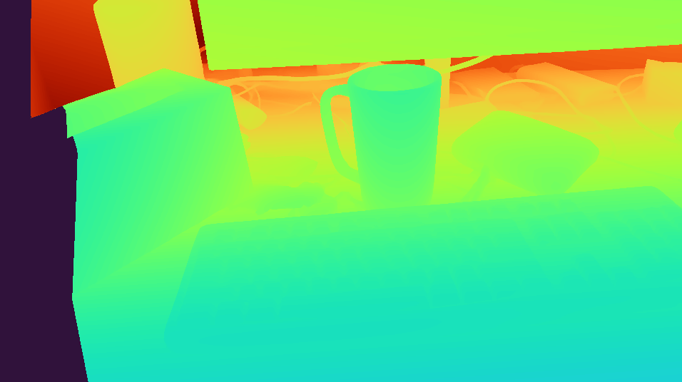

# FoundationStereo: Zero-Shot Stereo Matching
### [project website](https://nvlabs.github.io/FoundationStereo/) &emsp; &emsp; [arxiv paper](https://arxiv.org/abs/2501.09898) &emsp; &emsp; [video](https://www.youtube.com/watch?v=R7RgHxEXB3o)

Authors: Bowen Wen, Matthew Trepte, Joseph Aribido, Jan Kautz, Orazio Gallo, Stan Birchfield

**TLDR**: Our method takes as input a pair of stereo images and outputs a dense disparity map, which can be converted to a metric-scale depth map or 3D point cloud.

<p align="center">
  
</p>

This repository is a fork of FoundationStereo. Please see [readme_old.md](readme_old.md) for the original README. This fork includes instructions for installing FoundationStereo and running it as an inference server.

## Installation

**Prerequisites**:

- NVIDIA GPU (tested on RTX 3080, 3090, 4090, 5090)
- Linux (tested on Ubuntu)

We use [pixi](https://pixi.prefix.dev/) to manage the Python environment and dependencies. If you don't already have it installed, you can run:

```bash
curl -fsSL https://pixi.sh/install.sh | sh
```

Then restart or source your shell.

Once you have pixi installed, follow the instructions below to set up FoundationStereo:

```bash
# Clone the repository
git clone https://github.com/williamshen-nz/FoundationStereo.git
cd FoundationStereo

# Install dependencies (this may take a few minutes)
pixi run setup

# Download pretrained checkpoints
pixi run download-checkpoints
```

Next, run the demo script to ensure everything is set up correctly.

```bash
# Run the full demo (runs server and client)
pixi run demo
```

> **Tip:** to specify which GPU to use, prefix the command with `CUDA_VISIBLE_DEVICES=0` (or your desired GPU ID):
> ```bash
> CUDA_VISIBLE_DEVICES=0 pixi run demo
> ```

This will run both the server and a client that sends test images and displays the results. The output should look like the figure below.



After you've verified it's working, press `q` to close the cv2 window. Then in tmux, press `Ctrl+B`, then `D` to detach from the tmux session. The script will automatically tear down and exit.

## Running the Inference Server

Make sure you're in the project root directory, then run:

```bash
# Start the server (runs scripts/server.py)
# Default: listens on all interfaces at http://0.0.0.0:1234
pixi run server
```

**Tip:** to specify which GPU to use, prefix the command with `CUDA_VISIBLE_DEVICES=0` (or your desired GPU ID):
```bash
CUDA_VISIBLE_DEVICES=0 pixi run server
```

**Other options:**

```bash
# See all options
pixi run server --help

# Run server locally on port 1234
pixi run server --host 127.0.0.1 --port 1234
```

## Citation

If you find this work useful, please cite the original paper:

```bibtex
@article{wen2025stereo,
  title={FoundationStereo: Zero-Shot Stereo Matching},
  author={Bowen Wen and Matthew Trepte and Joseph Aribido and Jan Kautz and Orazio Gallo and Stan Birchfield},
  journal={CVPR},
  year={2025}
}
```
